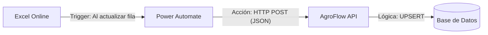

# Guía de Automatización Profesional: Excel Online ↔ AgroFlow

Para lograr una eficiencia máxima y que el sistema sea 100% práctico, utilizaremos **Power Automate** como el puente inteligente. Esto garantiza que cada vez que un posicionador modifique una fila en el Excel, la base de datos de AgroFlow se actualice **en tiempo real** sin que nadie tenga que presionar un solo botón.

## Arquitectura de la Solución



## Configuración Paso a Paso

### 1. El Disparador (Trigger)
En Power Automate, cree un flujo de nube automatizado:
- **Conector**: Excel Online (Business).
- **Trigger**: *When a row is modified* (Cuando se modifica una fila).
- **Parámetros**: Seleccione su archivo de Excel y la tabla correspondiente (ej: `POSIC`).

### 2. Formateo de Datos (Parse JSON)
Agregue una acción de **Parse JSON**:
- **Content**: El cuerpo dinámico de la fila de Excel.
- **Schema**: Use el archivo `power_automate_schema.json` que generé. Esto permitirá que Power Automate entienda qué es el Booking, qué es el ETD, etc.

### 3. Envío a AgroFlow (HTTP)
Agregue una acción **HTTP**:
- **Method**: `POST`
- **URI**: `https://tu-servicio-agroflow.render.com/api/v1/sync/posicionamiento`
- **Headers**:
  - `Content-Type`: `application/json`
  - `X-Sync-Token`: `[TU_TOKEN_DE_SEGURIDAD]`
- **Body**:
  ```json
  [
    {
      "booking": "@{body('Parse_JSON')?['booking']}",
      "nave": "@{body('Parse_JSON')?['nave']}",
      "o_beta": "@{body('Parse_JSON')?['o_beta']}",
      ... (mapear todos los campos necesarios)
    }
  ]
  ```

## Recomendaciones Profesionales

1. **Evitar Sobrecarga**: Power Automate enviará la actualización segundos después de que el usuario deje de escribir en la celda. Esto es ideal para flujos de trabajo concurrentes.
2. **Seguridad**: El `X-Sync-Token` asegura que solo su flujo de Power Automate pueda escribir en la base de datos de referencias.
3. **Mantenimiento**: Si añade una columna al Excel, solo debe actualizar el esquema JSON en Power Automate y añadir el campo al mapeo del paso HTTP.

---
> [!TIP]
> **¿Por qué es mejor que un script manual?**
> Con este método, AgroFlow se convierte en un sistema "vivo". Los datos fluyen solos, permitiendo que el tablero de control (Dashboard) y el módulo de Logicapture tengan siempre la información más reciente de los terminales y navieras sin intervención humana.
