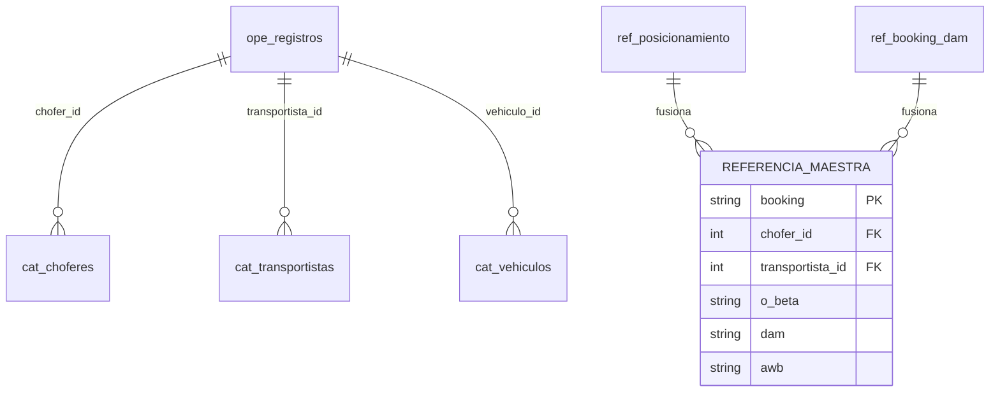

# Plan de Refactorización: Módulo LogiCapture & DB Operativa

**Autor:** Arquitecto de Software Principal
**Estado:** Análisis Completado / Listo para ejecución  
**Prioridad:** Alta (Seguridad de Datos y Mantenibilidad)

---

## 1. El Problema: "Isla de Datos"
Actualmente el backend funciona como un almacén de archivos Excel en lugar de una base de datos relacional. Tenemos:
1.  **Divergencia de datos:** El mismo Booking tiene información distinta en `ref_posicionamiento` y `ref_booking_dam`.
2.  **Inconsistencia de Catálogos:** En `ref_booking_dam` se guardan choferes y transportistas como texto plano, desconectados de las tablas maestras (`cat_choferes`).
3.  **Lógica Fragmentada:** El router `registros.py` intenta "pegar" partes de 4 fuentes distintas durante la creación de un registro, lo que lo hace frágil ante cambios.

---

## 2. Objetivo: Normalización Progresiva (Zero-Downtime)
Transformar el flujo de "Espejo de Excel" a "Base de Datos Relacional" profesional sin detener la operación actual.

---

## 3. Tareas Técnicas (Para el Especialista de Programación)

### TAREA-LC01: Unificación de la Capa de Referencia (Backend)
**Problema:** El router `referencias.py` mapea manualmente ~45 campos de dos tablas distintas cada vez que se consulta.
**Acción:** 
1. Crear `backend/app/services/referencia_service.py`.
2. Crear un método `obtener_referencia_unificada(booking: str)`.
3. Mover allí la lógica de "priorización" (ej: si existe en DAM, usar AWB de DAM; si no, usar Posicionamiento).
4. El router `api/v1/ref/booking/{booking}` ahora solo llamará a este servicio unificado.

### TAREA-LC02: Refactor de la Creación de Registros (Backend)
**Problema:** La función `crear_registro` tiene lógica de "clonación automática de vehículos" y "mezcla de refs" que la hace ilegible.
**Acción:**
1. Extraer la validación de vehículos y transportistas a `backend/app/services/registros_service.py`.
2. Implementar herencia atómica: Al crear un registro, el servicio hereda los campos fijos (`O_BETA`, `AWB`, `DAM`) directamente de la referencia maestra unificada en una sola transacción.

### TAREA-LC03: Normalización de la Referencia de Asignación (DB)
**Problema:** La tabla `ref_booking_dam` es "sucia" (usa strings para chofer/placas).
**Acción:** 
1. Agregar columnas `chofer_id` (FK a `cat_choferes`) y `transportista_id` (FK a `cat_transportistas`) a dicha tabla.
2. Crear un script de migración que asocie los IDs reales basándose en el DNI/RUC actuales.
3. El frontend ya no recibirá strings, recibirá el objeto Chofer completo con su ID.

### TAREA-LC04: Centralización de Modelos API (Frontend)
**Acción:**
1. Mover los tipos `BookingRefs` y `RegistroCreatePayload` en `frontend/lib/api.ts` a archivos de modelos dedicados (`frontend/models/operacion.ts`).
2. Eliminar el uso de `NEXT_PUBLIC_USER_ROLE` si quedó algún rastro en los componentes de este módulo.

---

## 4. Estructura de Datos Deseada (Conceptual)

---

## 5. Reglas de Negocio para el Programador
1.  **Cero Rupturas:** No borrar columnas de texto plano todavía. Coexistirán con los IDs hasta que la migración sea 100% segura.
2.  **Capa de Servicio:** El router NO debe hacer queries complejas a la base de datos. Solo recibe el HTTP, delega al Service y responde.
3.  **Auditoría:** Cada vez que el "Servicio de Referencia" corrija un dato de un Excel con otro, debe dejar un log interno para trazabilidad.

---

> [!IMPORTANT]
> Este plan asegura que cuando migremos a AWS RDS, la base de datos sea sólida, indexable y no dependa de "copias de archivos Excel" para funcionar.
