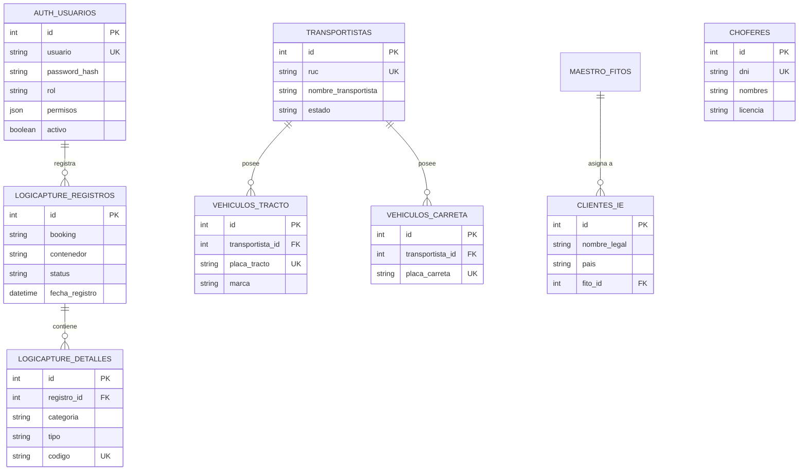

# Modelo de Datos y Diccionario - LogiCapture 1.0

Este documento describe la estructura de la base de datos PostgreSQL del sistema AgroFlow V2 (LogiCapture), detallando las entidades principales, sus atributos y relaciones.

---

## Diagrama de Entidades (ER)

---

## Diccionario de Tablas Principales

### 1. Gestión de Accesos (`auth_usuarios`)
Almacena las credenciales y permisos específicos de cada usuario del sistema.
- **`permisos`**: Campo JSON que permite habilitar/deshabilitar módulos específicos (ej. `lc_registro`, `m_bulk`) sin cambiar el rol global.

### 2. Maestros Logísticos
- **`transportistas`**: Empresas de transporte autorizadas.
- **`vehiculos_tracto` / `vehiculos_carreta`**: Unidades vehiculares vinculadas a un transportista mediante `transportista_id`.
- **`choferes`**: Conductores con validación de DNI y Licencia.
- **`clientes_ie`**: Clientes de Importación/Exportación. La unicidad se garantiza mediante la combinación de `nombre_legal`, `cultivo`, `pais` y `destino`.

### 3. Operaciones LogiCapture
- **`logicapture_registros`**: Cabecera de la operación de despacho. Almacena datos críticos como Booking, Contenedor y Placas.
- **`logicapture_detalles`**: Proporciona un "blindaje" sistémico. Almacena códigos de precintos y termógrafos con restricción `UNIQUE` para evitar que un mismo sello se use en múltiples embarques.

---

## Reglas de Integridad y Unicidad

1. **Unicidad de Precintos**: La tabla `logicapture_detalles` tiene un índice único en la columna `codigo`. Si se intenta registrar un precinto ya usado, el sistema rechazará la transacción.
2. **Eliminación en Cascada**: La mayoría de las relaciones secundarias (tractos, carretas, detalles) utilizan `ON DELETE CASCADE` para mantener la limpieza de la base de datos.
3. **Auditoría Pasiva**: Todas las tablas principales cuentan con campos `fecha_creacion` y `fecha_actualizacion` gestionados automáticamente por el servidor de base de datos.
